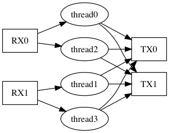
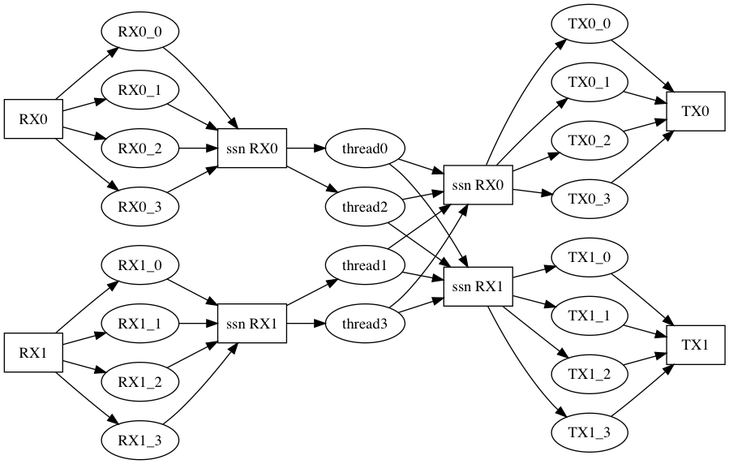

# Graphviz

## Install & Commands

```
$ brew install graphviz
$ sudo apt install graphviz
$ dot -T png main.dot -o main.png
$ dot -T png main.dot > main.png
```

## Sample

```
digraph {
	rankdir=LR
	RX0 [shape=box]
	RX1 [shape=box]
	TX0 [shape=box]
	TX1 [shape=box]

	RX0 -> thread0
	RX0 -> thread2
	RX1 -> thread1
	RX1 -> thread3

	thread0 -> TX0;
	thread1 -> TX0;
	thread2 -> TX0;
	thread3 -> TX0;
	thread0 -> TX1;
	thread1 -> TX1;
	thread2 -> TX1;
	thread3 -> TX1;
}
```




## Sample (more complex)

```
digraph {
	rankdir=LR

	RX0 [ label="RX0", shape=box ];
	RX1 [ label="RX1", shape=box ];
	TX0 [ label="TX0", shape=box ];
	TX1 [ label="TX1", shape=box ];

	ssn_RX0 [ label="ssn RX0", shape=box];
	ssn_RX1 [ label="ssn RX1", shape=box];
	ssn_TX0 [ label="ssn RX0", shape=box];
	ssn_TX1 [ label="ssn RX1", shape=box];

	RX0 -> RX0_0 -> ssn_RX0;
	RX0 -> RX0_1 -> ssn_RX0;
	RX0 -> RX0_2 -> ssn_RX0;
	RX0 -> RX0_3 -> ssn_RX0;

	RX1 -> RX1_0 -> ssn_RX1;
	RX1 -> RX1_1 -> ssn_RX1;
	RX1 -> RX1_2 -> ssn_RX1;
	RX1 -> RX1_3 -> ssn_RX1;

	ssn_TX0 -> TX0_0 -> TX0;
	ssn_TX0 -> TX0_1 -> TX0;
	ssn_TX0 -> TX0_2 -> TX0;
	ssn_TX0 -> TX0_3 -> TX0;
	ssn_TX1 -> TX1_0 -> TX1;
	ssn_TX1 -> TX1_1 -> TX1;
	ssn_TX1 -> TX1_2 -> TX1;
	ssn_TX1 -> TX1_3 -> TX1;

	ssn_RX0 -> thread0
	ssn_RX0 -> thread2
	ssn_RX1 -> thread1
	ssn_RX1 -> thread3

	thread0 -> ssn_TX0;
	thread1 -> ssn_TX0;
	thread2 -> ssn_TX0;
	thread3 -> ssn_TX0;
	thread0 -> ssn_TX1;
	thread1 -> ssn_TX1;
	thread2 -> ssn_TX1;
	thread3 -> ssn_TX1;
}
```



## オプション

- -Tpng: png file output
- -Tgif: gif file output


